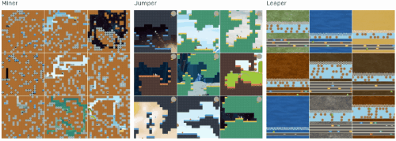

# Reinforcement Learning

> Code and instructions for techniques to apply reinforcement learning in only a few lines of code.

In this repo, you will find the code and instructions for [this article](https://towardsdatascience.com/reinforcement-learning-in-a-few-lines-of-code-d6c8af1e0fd2?source=friends_link&sk=fde20764574d8b7ff4a0522fcf800e8a). It is advised to read through the article whilst coding along using the **Reinforcement Learning.ipynb** notebook. 

This repo and the corresponding article describe several methods for simplifying your reinforcement learning code:
* Stable-baselines
* Gym
* Retro
* Procgen
* MlAgents
